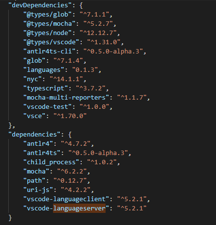

# Developer Guide

This Developer guide is for future senior design teams or other developers who want to extend or modify the project.

### Required Software Tools
- Java
- node.js and npm - documentation on installing them can be found [here](https://docs.npmjs.com/downloading-and-installing-node-js-and-npm)

StackEdit stores your files in your browser, which means all your files are automatically saved locally and are accessible **offline!**

### Install and Compile

Run the following command to install all the dependencies and generate parser.

    npm ci && npm run compile
    
List of all the dependencies can be found in `\package.json` file    

## Files
### ANTLR4 Grammar
Our grammar files are in `\src\compiling\ANTLR\grammar\` and if you want to edit them, refer to the [ANTLR4 Documentation](https://github.com/antlr/antlr4/blob/master/doc/index.md) for information on ANTLR, or [IEEE Standard 1800-2017](https://ieeexplore.ieee.org/servlet/opac?punumber=8299593) for the the formal syntax they are based on. `SystemVerilog.g4` is the root file for the grammar.

### Preprocessor
Replaces portions of code with other code

### Abstract Syntax Tree
Abstract Syntax Tree contains high level information about SystemVerilog code structure

### Include Tree and Handler

## Testing
### Documentations
- [Tutorial](https://vscode.rocks/testing/) for testing your extension using [MochaJS](https://mochajs.org/)
- Documentation on writing tests for vscode extension - [Testing Extension](https://code.visualstudio.com/api/working-with-extensions/testing-extension)
### Running Tests
- Open the terminal and run one of the following commands on root of the project:

	    npm run test
		npm run compile && node ./out/test/runTest.js

- VSCode Extension Development Host opens up and runs the tests
- Test results are displayed on terminal or you can find the generated xml test results file on root - `results.xml` .
### Code Coverage
- coverage.ts file is added for code coverage
  - uses `istanbul` api 
  - used custom coveras script written by Microsoft Developer Alexandru Dima
    https://github.com/alexdima/vscode-extension-coverage-sample

- Run the following command to generate coverage report 

    	npm run coverage

### Adding new tests
All test classes and test files can be found in `test` directory

    \src\test

SystemVerilog files used in testing are located in `test-files` directory

    \src\test\test-files
