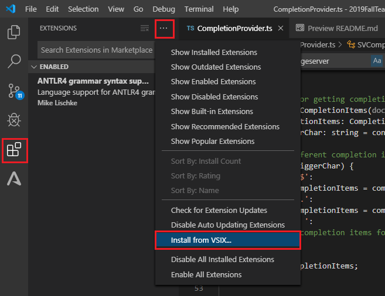
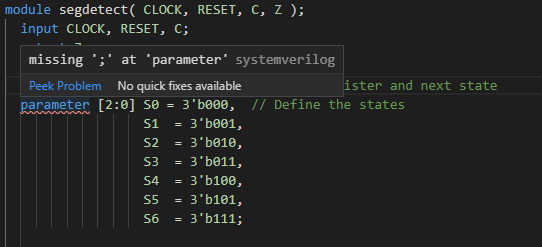

# User Guide
User guide includes
- Installation instruction
- Brief explanation of added features
- Available settings
- Known issues

## Installing 
### From VSIX file
Have copy of `.vsix` file for the extension? 
- Open VSCode
- Click extenstions tab
- Click menu, then click `Install from VSIX`
- Browse to VSIX file, click the file
- Click `install`

	

-  Reload the window by running  `Developer: Reload window`  command.

### From Marketplace
Once the additional features are included in the release version of the extension, users can install the extension directly from the Marketplace.
Getting released version from VS Code Marketplace.
- Click on extensions tab
- Search for "systemverilog"
- Click on result: **SystemVerilog - Language Support**
- Click `Install` button

	

## Features
### Syntax Error Identification
- Fast real-time error identification through an integrated SystemVerilog parser and IntelliSense ( Fully accurate to IEEE Standard 1800-2017 )

	

	

### Autocomplete Code

	

## Settings
Change the settings listed below to customize the extension experience.

	

- `Antlr Verification`: Use ANTLR parser to verify code in real-time
- `Compile On Save`: Compile SystemVerilog files when saved
	* Default: *true* 
- `Compiler Type` : Select a compiler type from the drop down list
	* Default: *Verilator*
- `Disable Indexing`: Disable indexing when opening folder or workspace
- `Exclude Indexing`: Exclude files from indexing based on glob pattern 
- `Parallel Processing`: *Number* of files it should attempt to process in parallel. Processing consist of opening found files and perform matching to find symbols.
-  `Launch Configuration`: _String_, the command to run when launching verilator
	* Default: _verilator --sv --lint-only --language 1800-2012 --Wall_
	* If not in path, replace _verilator_ with the appropriate command
- `Trace:server`: Select verbosity of LSP message tracing from drop down menu

## Known Issues

- Starting up may be a little bit slow if it's a large workspace with many `.sv` files because of indexing
- If you experience the slowness, use the setting: `systemverilog.forceFastIndexing`